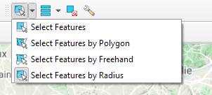
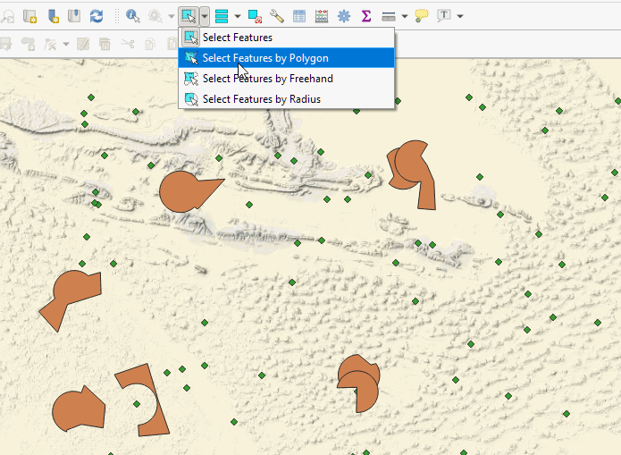
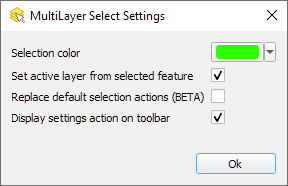
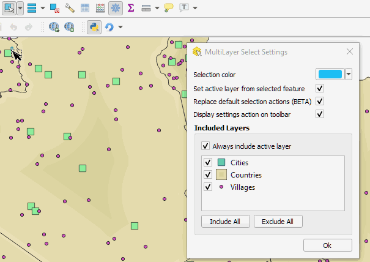

Multilayer Select (QGIS plugin)
===

Add new selection tools that work across layers.

- Select by Click
- Select by Rectangle
- Select by Polygon (and freehand while mouse is pressed)
- Select by Freehand
- Select by Radius
- Add/Remove to/from selection when pressing Shift/Ctrl
- Select all features from all layers
- Invert all features
- Select by expression

One can also exclude some layers, that will not be used by the mutli selection tools (see [Settings dialog](#settings))

**Example**: Multi selection with the polygon tool

Settings dialog
---

 
 - **Selection color**: affect icons, rubberband, and features
 - **Set active..**: If enabled and the active layer has no selected feature, change the active layer to the first layer with at least one selected feature
 - **Replace default action**: If True, replace the QGIS selection tool with the multilayer selection tools. Else, add the  multilayer selection tools in their own toolbar
 - **Display settings action on toolbar**
 - **Included Layers**: list the vector layers in the current project. Unchecked layers will be ignored by the multilayer selection tools (useful for ignoring a vector basemap for instance).
   - If  *Exclude hidden layers* is checked (default), the selection tools will not select or deselect any feature belonging to hidden layers (unchecked in the QGIS layer tree view)
   - If  *Always include active layer* is checked (default), the active layer will not be ignored even if it is unchecked in the list.

**Exclusion example**

*Copyright © 2020 Yoann Quenach de Quivillic*

